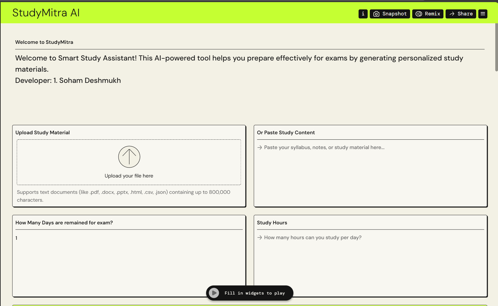
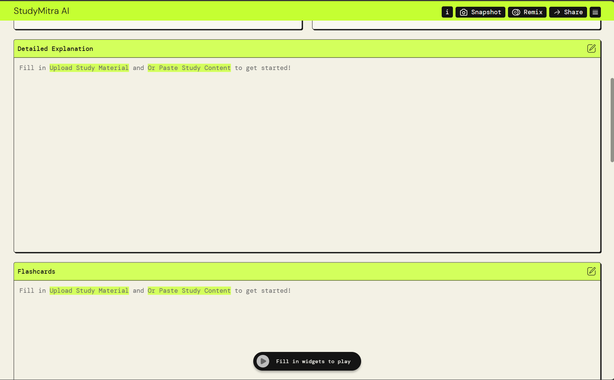
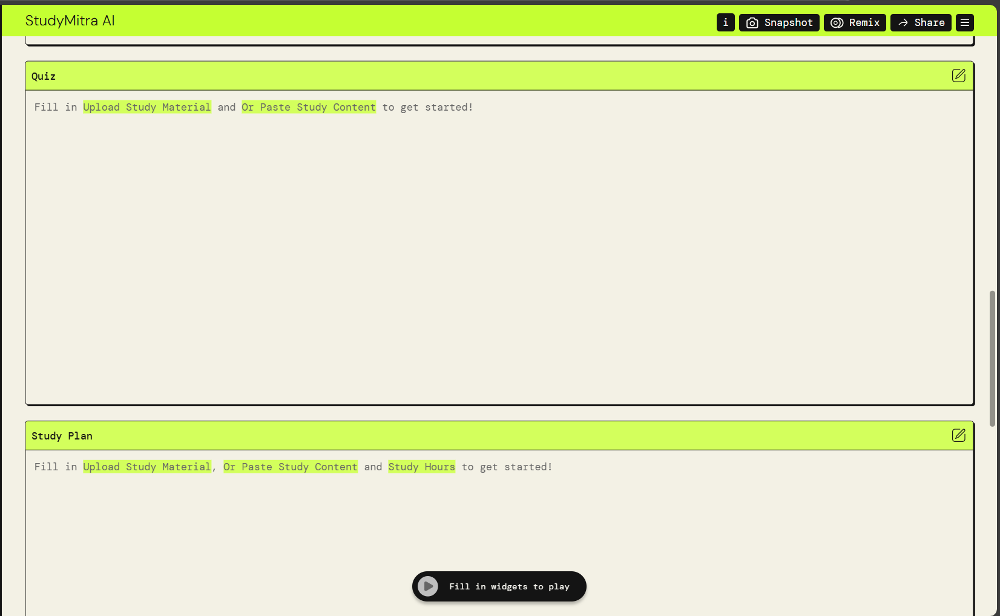
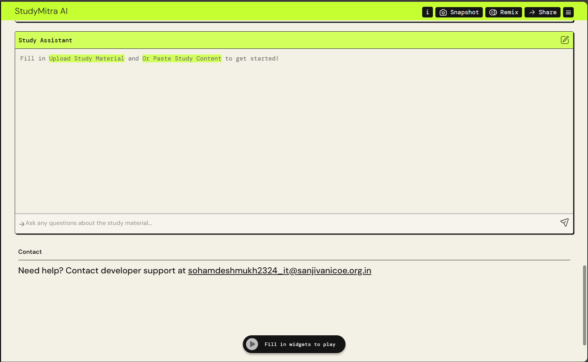

# 📚 StudyMitra – Your Calm and Helpful Study Companion

---

## 🌟 What is StudyMitra-AI?

**StudyMitra-AI** is a calm and helpful web application designed for students preparing for exams. Built using AWS PartyRock, it offers personalized study support—simplifying content, creating revision plans, and guiding learning step by step.

> This tool isn't meant to overwhelm you. It's made to help you breathe, focus, and move forward—one topic at a time.

---

## ✨ Features

- 📄 **Upload Notes or Syllabus** – Input your study material for AI-powered support  
- 💡 **Teach Me Mode** – Understand difficult topics in simple language  
- 🧾 **Flashcards** – Revise quickly with auto-generated flashcards  
- ✅ **Quiz Me** – Practice multiple-choice questions with feedback  
- 📅 **Study Planner** – Get a custom schedule based on your exam date  
- 📊 **Progress Tracker** – Visualize your study status and focus areas  

---

## 🔗 Live App

🎯 Launch StudyMitra-AI on AWS PartyRock:  
👉 [**Try it here**](https://partyrock.aws/u/captain-soham/S0cWYw1Bb/StudyMitra-AI)

---

## 🖼️ Screenshots

### Input Screen

### Detailed Explanation & Flashcards

### Study Plan & Quiz

### AI Study Assistant

---

## 🚀 How to Use

1. Open the app link above
2. Paste or upload your syllabus or text notes
3. Select modes like "Teach Me", "Flashcards", or "Quiz Me"
4. Enter your exam date and available hours to create your daily plan
5. Use the progress tracker to stay focused and on track

📌 *Note: AWS PartyRock does not support email sending or PDF export at this time.*

---

## 👨‍💻 Developer Info

Created by **Soham Deshmukh**  
This project was made to support students with meaningful, organized study guidance during exam season.

---

## 📬 Contact

- Email: **sohamdeshmukh2324_it@sanjivanicoe.org.in**

---

## 📄 License

This project is open under the [MIT License](LICENSE).

---

## 🧭 A Final Note

StudyMitra-AI is meant to be your quiet guide during exam preparation. It's built to make learning feel lighter, more organized, and a little less lonely. Use it as a companion, and if it helps you stay focused, then its purpose is fulfilled.

Feel free to contribute, improve, or just pass it on to someone who might need it.